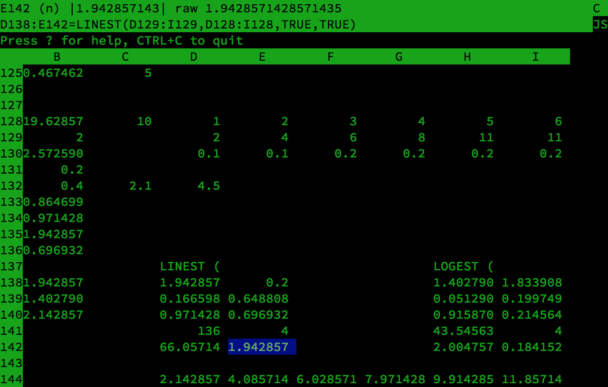
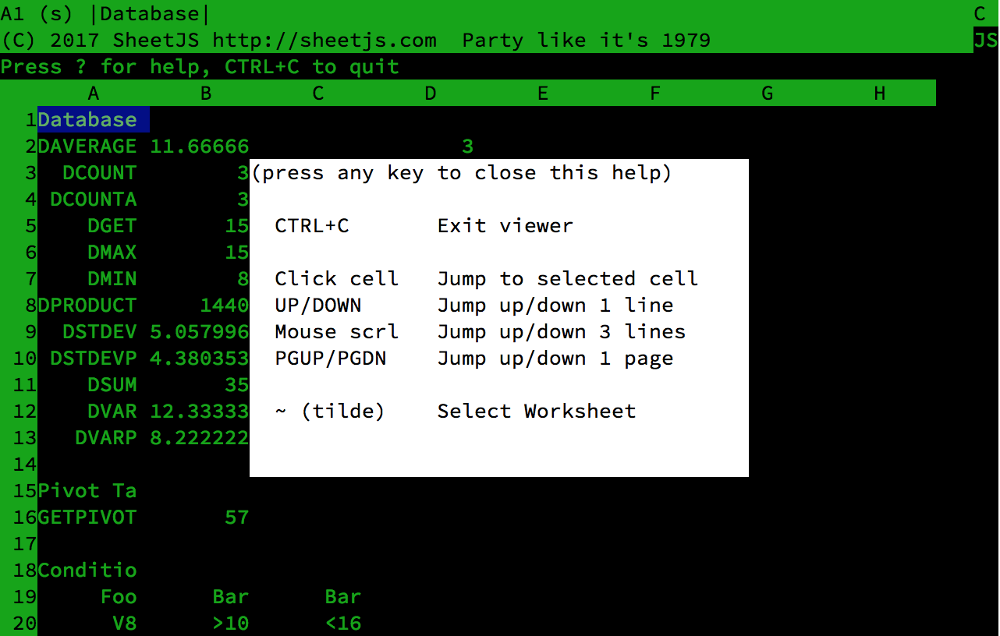
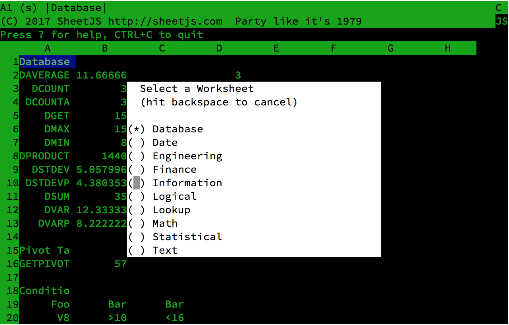

# wk

Preview spreadsheets in your terminal!



## Installation

```bash
$ npm install -g wk
```

## Usage

```bash
$ wk test.xlsx
```

- `CTRL+C` quits the viewer.

- `?` displays the help message:



- `~` shows the worksheet selection screen:



## License

Please consult the attached LICENSE file for details.  All rights not explicitly
granted by the Apache 2.0 license are reserved by the Original Author.

[](https://ghit.me/repo/sheetjs/js-xlsx)
[](https://github.com/SheetJS/wk)
